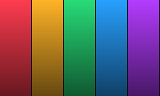

# Phosphor

## Terminal Presentations, Reimagined

<!-- notes: This is the demo deck. Use arrow keys or space to advance. Press 'q' to quit. -->

---

# Features

<!-- chunk -->

- Markdown-authored slides with {key: rich formatting}
- {definition: Bar and line charts} from CSV data
- Architecture diagrams with {jargon: box-drawing DSL}
- {emphasis: Halfblock raster images} from PNG/JPG
- Scramble transitions between slides
- Presenter notes synced to a separate terminal

<!-- chunk -->

All rendered natively in the terminal. No browser. No Electron.

<!-- notes: Each chunk reveals progressively. The audience sees the bullet points appear one group at a time. -->

---

# Semantic Highlighting

<!-- chunk -->

Define custom text classes in your theme, then use them inline:

<!-- chunk -->

- {key: Key concepts} stand out in warm yellow
- {jargon: Technical jargon} gets its own style
- {definition: Definitions} are clearly marked
- {emphasis: Emphasis} for things that matter
- {warning: Warnings} when something's dangerous

<!-- chunk -->

Syntax: `{class: your text here}`

<!-- notes: The highlight classes are defined in the theme YAML under the 'highlights' key. You can define as many as you want. -->

---

# Bar Charts

```chart
type: bar
file: data/languages.csv
title: Terminal Tool Languages (%)
color: magenta
```

<!-- notes: Charts scale to fill available terminal space. Resize your terminal to see them adapt. -->

---

# Line Charts

```chart
type: line
file: data/performance.csv
title: Throughput Over Time
x_label: Iteration
y_label: Ops/sec
color: cyan
```

<!-- notes: Line charts use braille characters for sub-cell resolution. -->

---

# Tables

| Feature | Phosphor | Slides.com | PowerPoint |
|---|---|---|---|
| Terminal native | Yes | No | No |
| Markdown source | Yes | No | No |
| Version control | Yes | Partial | No |
| Offline | Yes | No | Yes |
| Charts from CSV | Yes | No | No |

<!-- notes: Tables auto-size columns and shrink proportionally if the terminal is too narrow. -->

---

# Architecture Diagrams

```diagram
[Markdown] -> [Parser] -> [SlideElements]
[SlideElements] -> [Lower] -> [RenderOps]
[RenderOps] -> [Engine] -> [Terminal]
```

<!-- chunk -->

Diagrams auto-wrap chains to fit the terminal width.

<!-- notes: The diagram DSL is simple: [Box] -> [Box] chains, one per line. Same-named boxes are deduplicated. -->

---

# Images



<!-- notes: Images render using halfblock characters. Each terminal cell = 2 vertical pixels. Resize the terminal to change resolution. Cmd-minus for more detail. -->

---

# Presenter Notes

<!-- chunk -->

Run the presenter in one terminal:

```
phosphor slides.md
```

<!-- chunk -->

Connect the notes viewer in another:

```
phosphor slides.md notes
```

<!-- chunk -->

Notes sync automatically via Unix domain socket.

<!-- notes: This is what the notes viewer shows. It includes an elapsed time counter and the current slide's notes text. Great for keeping track of time during a talk. -->

---

# Theming

<!-- chunk -->

Built-in themes: {key: synthwave}, {jargon: ultra-dark}, {definition: phosphor}

<!-- chunk -->

Custom themes via YAML:

```yaml
palette:
  hot_pink: "#ff2975"
  neon_cyan: "#00e5ff"
slide:
  bg: "#0e0b1e"
  fg: "#e0d0ff"
highlights:
  key:
    fg: hot_pink
    bold: true
```

<!-- notes: Theme path can be set in front matter or via the --theme CLI flag. -->

---

# That's Phosphor

Built with Rust + ratatui. Slides are just Markdown.

`cargo install phosphor`

<!-- notes: Let this slide breathe. Open for questions. -->
