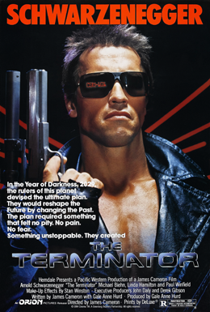

# DiRAC Detector

```wireframe
model: detector
rotate: 35,20
spin: 8
particles: on
```

<!-- notes: Live wireframe of the DiRAC single-tower calorimeter, rendered from Geant4 geometry. Let it spin while the audience settles in. -->

---

# CYBERDYNE SYSTEMS MODEL 101

## SCINTILLATOR CALORIMETRY DIVISION

INITIALIZING...

<!-- notes: Fake boot sequence opener. Terminator aesthetic hook — let it breathe for a beat before advancing. -->

---

# AI as Lubricant for HEP Experiments

Ted Kolberg — FSU HEP Seminar

April 24, 2025

<!-- notes: Framing: this is not a tools demo. It's about how the cost structure of experimental HEP work is changing and what that means for collaborations. -->

---

# The Overhead Problem

<!-- chunk -->

What does a working physicist actually spend their time on?

<!-- chunk -->

```chart
type: bar
file: data/overhead_time.csv
title: Approximate Weekly Hours (%)
color: magenta
```

<!-- chunk -->

The ratio of physics to non-physics work is worse than anyone admits.

<!-- notes: Draw on concrete HGCAL and DUNE examples from FSU. The audience knows this ratio in their bones — name it explicitly. The bar chart makes the disproportion visceral. -->

---

# AI as Friction Remover

<!-- chunk -->

LLMs are well-matched to the {key: overhead layer}:

<!-- chunk -->

- Summarizing meeting notes and technical documents
- Drafting {definition: BCR} narratives and procurement justifications
- Navigating vendor datasheets and PCB communication
- Translating between formats, frameworks, and conventions
- Boilerplate code, test stand scripts, parsers

<!-- chunk -->

Where they fail and quietly mislead — {warning: calibrating trust}

<!-- notes: These are real tasks from HGCAL and DUNE work at FSU. The audience does these tasks. Name them. -->

---

# Example: BCR Narrative Drafting

<!-- chunk -->

A {definition: Baseline Change Request} requires 2-4 pages of technical justification, cost impact, schedule analysis, and risk assessment.

<!-- chunk -->

| | Manual | AI-Augmented |
|---|---|---|
| Draft time | 4 hours | 20 min |
| Review cycles | 2-3 | 1 |
| Format compliance | Variable | Consistent |

<!-- chunk -->

The AI doesn't know the project. You do. It handles the {key: format translation} — you supply the {key: judgment}.

<!-- notes: Show a real before/after if possible. The key insight: the AI is good at the FORMAT, not the CONTENT. The physicist still needs to know what matters. -->

---

# Example: Legacy Code Archaeology

<!-- chunk -->

Scenario: navigate an undocumented {jargon: CMSSW} module to understand a calibration workflow written by a postdoc who left 3 years ago.

<!-- chunk -->

- 400 lines of C++ with no comments
- Depends on 6 framework interfaces you've never seen
- The person who wrote it isn't answering email

<!-- chunk -->

An LLM can trace the call graph, summarize the logic, and identify the key parameters in minutes.

{warning: But it can also confidently explain code that doesn't do what it thinks it does.}

<!-- notes: This is a real pattern from HGCAL work. The AI is great at the initial survey but dangerous for subtle logic bugs. Always verify the physics. -->

---

# Example: Test Stand Glue Code

<!-- chunk -->

You need a parser for a vendor's proprietary output format to feed your DAQ validation pipeline.

<!-- chunk -->

- Not worth a week of your time
- {emphasis: Not worth zero of your time either}
- Previously: skip it, eyeball the plots, move on

<!-- chunk -->

Now: 30 minutes to a working parser with tests. The {key: throwaway code becomes a first-class citizen}.

<!-- notes: This is the marginal cost argument in miniature. The parser itself is trivial — the point is that it gets written at all. -->

---

# The Marginal Cost Shift

<!-- chunk -->

The set of things {key: worth attempting} has changed.

<!-- chunk -->

- Cheaper exploration: more branches tried, bad ones killed faster
- {emphasis: Throwaway code as first-class citizen}
- Checks you used to skip now get run
- Prototype-heavy hardware workflows: glue code, test stand scripts, parsers

<!-- chunk -->

The cost of {warning: not exploring} rises.

Static groups fall behind on a timescale nobody's calibrated for.

<!-- notes: This is the positive economic argument. But more output can also mean more noise — set up the transition to the rat bounty. -->

---

# The Hanoi Rat Bounty

<!-- chunk -->

French colonial Hanoi, early 1900s.

<!-- chunk -->

The administration offered a {key: bounty per rat tail} to control sewer rats.

<!-- chunk -->

Workers caught rats, cut off tails, {emphasis: released them to breed more}.

<!-- chunk -->

Some residents started {emphasis: rat farms}.

<!-- chunk -->

The bounty program made the rat problem {warning: worse}.

<!-- notes: Let each chunk land. The audience should see the punchline coming by chunk 4. The parallel to AI-generated "evidence of work" should be obvious without stating it yet. -->

---

# Producing Tails

<!-- chunk -->

AI makes it trivially cheap to produce "tails":

plots, studies, code, status reports

<!-- chunk -->

{warning: Nobody's checking whether the rats are actually dead.}

<!-- chunk -->

> "I asked Claude and it said..."

as a new failure mode in meetings

<!-- chunk -->

The bottleneck moves from {key: implementation} to {key: taste} — knowing which explorations matter.

<!-- notes: The Goodhart's Law connection: when producing the artifact is cheap, the artifact stops being a reliable signal of the work behind it. -->

---

# What's Actually at Risk

<!-- chunk -->

James C. Scott, *Seeing Like a State* (1998):

High-modernist schemes fail when they replace {jargon: metis} (practical local knowledge) with legible simplifications.

<!-- chunk -->

Prussian scientific forestry: beautiful monocultures that collapsed a generation later.

They {warning: eliminated the ecological complexity they didn't understand}.

<!-- chunk -->

Large HEP collaborations are already high-modernist institutions.

The {jargon: metis} is everything that actually makes them work.

<!-- notes: Hallway knowledge, debugging sessions, shared vendor frustrations, undocumented tribal lore. AI optimizes the legible layer and risks eroding the illegible one. Harry Collins on interactional vs. contributory expertise — studied specifically in gravitational wave physics. -->

---

# Who Pays

<!-- chunk -->

Overhead isn't just waste — it's scaffolding for FTEs, funding lines, training pipelines.

<!-- chunk -->

- Automating the {definition: BCR} saves the PI time {emphasis: and} erodes the line item for the person who drafted it
- Students learned the experiment through the busywork — what replaces that {key: apprenticeship}?
- Technical staff whose value was partly measured in tasks now being absorbed

<!-- chunk -->

The {warning: displacement question}: reinvestment vs. attrition

<!-- notes: This is where it gets uncomfortable for the room. Don't soften it. The audience includes grad students and postdocs whose job descriptions overlap with what LLMs do well. -->

---

# So What Do We Actually Do With It?

<!-- chunk -->

Not overhead reduction. Not automation. {key: Physics that wasn't possible before.}

<!-- chunk -->

What if the tool isn't just a lubricant for busywork — but a building material for new approaches?

<!-- notes: Pivot from the sociological argument to the technical payoff. This is the bridge to DiRAC. The audience has been hearing about risks for 10 minutes — now show them the upside. -->

---

# DiRAC

## Differentiable Reconstruction And Calibration

<!-- chunk -->

A {key: fully differentiable} surrogate model for calorimeter calibration.

<!-- chunk -->

Built from scratch in 6 weeks — one physicist, one AI pair programmer.

{emphasis: This project would not exist without the marginal cost shift.}

<!-- notes: Emphasize: not a toy demo. This is a working calibration pipeline that outperforms the traditional approach on Geant4 simulated data. The 6-week timeline is the point — this is what cheap exploration enables. -->

---

# The Calibration Problem

<!-- chunk -->

A calorimeter has {definition: O(100)} channels, each with its own gain.

<!-- chunk -->

Traditional approach: calibrate each channel independently.

- Inject known signal, measure response
- Fit {jargon: Landau} distribution, extract peak
- Ratio of observed/nominal = gain correction

<!-- chunk -->

{warning: No learned correlations between channels. No shared information across the detector.}

<!-- notes: The audience knows this workflow. The point is that per-channel calibration throws away information about the correlations that the shower physics creates. -->

---

# The DiRAC Approach

<!-- chunk -->

Train a neural network surrogate that learns the {key: full detector response}.

<!-- chunk -->

```diagram
[Particle Features] -> [Per-Channel MLP] -> [Graph Neural Network] -> [Signal Head]
[Calibration Params] -> [Per-Channel MLP]
[Geometry Features] -> [Per-Channel MLP]
[Graph Neural Network] -> [Occupancy Head]
```

---

# Differentiable Inference

Freeze the surrogate. Use it as a {key: differentiable bridge} to infer optimal gains via gradient descent.

<!-- notes: The key insight: the GNN captures inter-channel correlations that per-channel methods miss. The Laplace parameterization gives clean analytical gradients. -->

---

# Detector Geometry — Wireframe

```wireframe
model: detector
rotate: 35,20
spin: 8
particles: on
```

<!-- notes: Wireframe rendered live from the Geant4 geometry. Single-tower sampling calorimeter: 6 EM layers (Pb/Si, orange/blue) followed by 4 HAD layers (Steel/Scintillator, purple/green). Red X marks the EM/HAD boundary. 3×3 sensor grids visible on first and last layers of each section. Rotates continuously. -->

---

# Detector Geometry

| | EM Section | HAD Section |
|---|---|---|
| Absorber | Pb, 2mm | Steel, 40mm |
| Sensor | Si, 0.3mm | Scintillator, 3mm |
| Pitch | 5mm | 30mm |
| Layers | 6 | 4 |
| Channels | 54 | 36 |

{definition: 90 total channels} across 10 layers — compact enough to iterate fast, complex enough to be interesting.

<!-- notes: This is a simplified but physically realistic detector. Silicon EM section with fine granularity, scintillator HAD section with coarser tiles. The geometry is close to HGCAL concepts. -->

---

# Surrogate Training

```chart
type: line
file: data/dirac_training_loss.csv
title: Surrogate Training Loss (Laplace NLL + BCE)
x_label: Epoch
y_label: Loss
color: cyan
```

<!-- notes: The surrogate trains on both Geant4 and synthetic data. Converges in ~20 epochs. The loss combines Laplace NLL for signal prediction and BCE for occupancy classification. -->

---

# Calibration Results

```chart
type: bar
file: data/dirac_calibration.csv
title: Calibration Error (x10^4) — Lower is Better
color: green
```

<!-- notes: Three benchmark scenarios. The pipeline wins on eval_v2 (38% reduction), g4_v2 (47% reduction), and single_tower (38% reduction). The baseline is traditional per-channel median + Landau fit. -->

---

# Inference Convergence

```chart
type: line
file: data/inference_convergence.csv
title: Gain Error vs Optimization Steps
x_label: Adam Steps
y_label: Relative Error
color: yellow
```

{emphasis: 200-500 Adam steps} to converge. Gradients flow end-to-end: {jargon: d(loss)/d(gain)} through the entire frozen surrogate.

<!-- notes: The frozen surrogate acts as a differentiable physics simulator. The optimizer adjusts all 90 gain parameters simultaneously, exploiting learned correlations. Converges in seconds on GPU. -->

---

# Why This Matters

<!-- chunk -->

| | Traditional | DiRAC |
|---|---|---|
| Correlations | None | Learned via GNN |
| Optimization | Per-channel | Joint (90 params) |
| Gradient signal | N/A | All channels, every event |
| Development time | Months | 6 weeks |

<!-- chunk -->

The {key: marginal cost} of attempting a fully differentiable pipeline dropped below the threshold of {emphasis: worth trying}.

<!-- chunk -->

That threshold is the whole talk.

<!-- notes: Bring it full circle. DiRAC exists because the cost of writing throwaway ML code dropped enough to make it worth exploring. The same physicist would not have attempted this approach 2 years ago — not because it's impossible, but because the expected cost/benefit didn't justify starting. -->

---

# What Collaborations Should Actually Do

<!-- chunk -->

Invest in the {jargon: metis} layer deliberately.

The informal knowledge transfer that AI can't see.

<!-- chunk -->

Reorganize reward structures before the {emphasis: rat farms} get built.

<!-- chunk -->

Measure exploration, not just output. The {key: taste} problem is a hiring problem.

<!-- notes: This section is deliberately short. The audience should be thinking about their own collaborations. Open for discussion. -->

---

# Come With Me If You Want to Live



<!-- notes: Let the image sit for a moment before opening Q&A. -->
